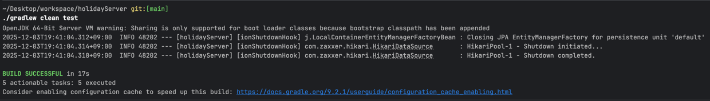

# 플랜잇스퀘어 백엔드 개발자 채용 과제

## 빌드 & 실행 방법

- `H2 database` 설치
- `JDBC URL`에 `jdbc:h2:~/holiday` 최초 접속
- `~/holiday.mv.db` 파일 생성 확인
- `JDBC URL`에 `jdbc:h2:tcp://localhost/~/holiday` 입력
- `./gradlew clean build` 빌드 확인
- `./gradlew clean test` 테스트 확인
- `./gradlew bootRun` 실행

## 설계한 REST API 명세 요약 (엔드포인트, 파라미터, 응답 예시)

### 공휴일 검색 필터 API

- 예시

```http request
GET /holidays?countryCode=KR&year=2024&size=10&page=1&type=Public
```

- 엔드포인트: `GET /holidays`
- 쿼리 파라미터:

```
- countryCode: 나라코드(ISO 3166-1 alpha-2)
- year: 연도 (1900 ~ 2100)
- startDate: 기간 검색 - 시작날짜
- endDate: 기간 검색 - 마지막날짜
- type: 공휴일 타입 (Public, Bank, School, Authorities, Optional, Observance)
- page: 페이지 번호 (0 부터 시작)
- size: 페이지 사이즈
```

- 응답 예시:

```json
{
  "items": [
    {
      "id": 4640,
      "countryCode": "KR",
      "name": "Independence Movement Day",
      "localName": "3·1절",
      "date": "2024-03-01"
    },
    {
      "id": 4639,
      "countryCode": "KR",
      "name": "Lunar New Year",
      "localName": "설날",
      "date": "2024-02-12"
    },
    {
      "id": 4638,
      "countryCode": "KR",
      "name": "Lunar New Year",
      "localName": "설날",
      "date": "2024-02-10"
    },
    {
      "id": 4637,
      "countryCode": "KR",
      "name": "Lunar New Year",
      "localName": "설날",
      "date": "2024-02-09"
    },
    {
      "id": 4636,
      "countryCode": "KR",
      "name": "New Year's Day",
      "localName": "새해",
      "date": "2024-01-01"
    }
  ],
  "page": {
    "totalCount": 15,
    "totalPages": 2,
    "currentPage": 2,
    "hasNext": false,
    "hasPrevious": true
  }
}
```

### 공휴일 재동기화 API

- 예시

```http request
POST /holidays/refresh
```

- 엔드포인트: `POST /holidays/refresh`
- 리퀘스트 바디:

```
- countryCode: 나라코드(ISO 3166-1 alpha-2)
- year: 연도 (1900 ~ 2100)
```

- 응답 예시:

```json
{
  "countryCode": "KR",
  "year": 2024,
  "refreshed": true,
  "total": 15
}
```

### 공휴일 삭제 API

- 예시

```http request
DELETE /holidays?countryCode=KR&year=2024
```

- 엔드포인트: `DELETE /holidays`
- 쿼리 파라미터:

```
- countryCode: 나라코드(ISO 3166-1 alpha-2)
- year: 연도 (1900 ~ 2100)
```

- 응답 예시:

## ./gradlew clean test 성공 스크린샷



## Swagger UI 또는 OpenAPI JSON 노출 확인 방법

### Swagger UI

- [LINK](http://localhost:8080/swagger-ui/index.html)
- `./gradlew bootRun` 후 위 `LINK` 클릭